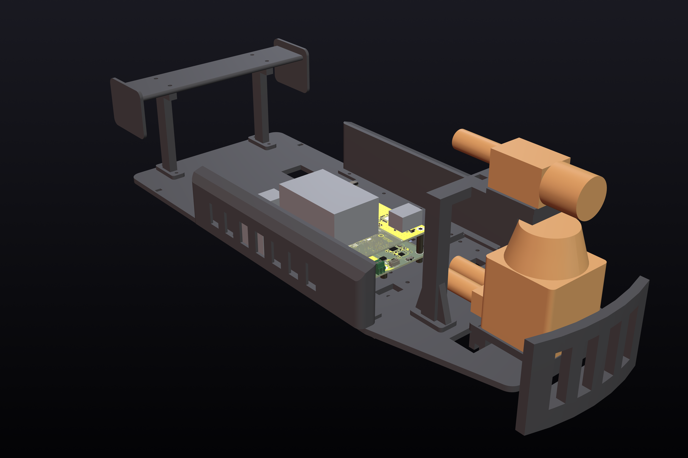

# Atlas car v2

The second Atlas Autoware car: a Traxxas Slash 4x4 with a Holmes Hobbies Puller Pro 540 motor, a
SICK TiM561 lidar and a LUCID Triton camera, rebuilt so that almost nothing is wired by hand. Two
custom circuit boards stack on a carbon-fibre-printed deck:

- **Drive board (ATLAS-DRV-1).** The ESC (VESC firmware, same UART commands as car 1), a battery
  protector for a built-in 4S3P 18650 pack, USB-C charging, the servo supply, the lidar's power
  switch and a USB hub.
- **Brain board (ATLAS-BRN-1).** A Jetson Orin Nano carrier forked from Antmicro's open-source
  design, with PoE for the camera and a second Ethernet port for the lidar.

Day to day the car needs one USB-C cable: a 65 W laptop charger charges it, and a laptop on the same
port reaches the Jetson, the ESC and the serial console.

## What is in here

| folder | what |
| --- | --- |
| `docs/` | `ARCHITECTURE.md` (the whole design and why), `PACK_BUILD.md` (building the 18650 pack), `MEASURE_FIRST.md` (chassis numbers to check before printing), `COMPLETE_CAR.md` (the parts that finish the car), `WIRING.md` (every cable run and its length) |
| `boards/drive/`, `boards/brain/` | the two boards: `design.py` is the circuit, `layout.py` the placement and hand-drawn copper, and the KiCad schematics and layouts are generated from them |
| `boards/stack/` | the pin map of the connector between the two boards, used by both |
| `boards/tools/` | the scripts that build, route and check the boards |
| `boards/*/out/fab/` | Gerbers, drill files, pick-and-place and BOM for ordering |
| `firmware/vesc/` | the VESC hardware target for the drive board |
| `mech/` | the printed kit: `kit.py` (deck, pods, mounts, pack box) and `extras.py` (stack canopy, bench stand, plugs and cable paths), the STL/STEP files, renders and its own README |
| `sim/` | circuit and thermal checks run on the finished schematics, with their own README |
| `bom/` | the parts list with prices and the cost summary |
| `share/` | pictures for posting; `car_scene.py` and `render_car.py` render the whole car |

## Cost

From `bom/cost_summary.md` (prices from September 2026):

| | USD |
| --- | ---: |
| Drive board: 5 boards, 1 of them assembled | 525.70 |
| Brain board: 5 boards, 1 of them assembled | 563.90 |
| 18650 pack materials | 134.20 |
| Camera lens | 144.00 |
| Charger, cable, fan, thermal pad, hardware, antennas | 124.35 |
| **New purchases** | **1,492.15** |
| Jetson dev kit and NVMe (already on the purchase list) | 459.00 |
| **Car 2 total** | **1,951.15** |
| If needed: M12 camera cable ($30), spot welder ($304.51) | up to 2,285.66 |

The carbon-fibre filament and the aluminium heat spreader (SendCutSend credit) are not in these
numbers because the team already has them.

## Status

On 27 September 2026 the design is finished and nothing has been ordered. Later that day the whole car went into
one model, with every plug and cable. That found two things that could not have been assembled as drawn, now
fixed, and added a canopy over the boards with the Wi-Fi antennas and a bench stand (`docs/COMPLETE_CAR.md`).

- Both boards are routed. KiCad's DRC finds no unconnected nets and no clearance errors on
  either of them. What it still lists is minor: silkscreen warnings on both boards, one 0.2 mm
  track end on the drive board, and on the brain board the footprint-library differences that
  come with Antmicro's design and the courtyard and hole overlaps Antmicro excluded.
- The stack header matches on both boards: all 40 pins carry the same net at the same place, and
  the brain board's corner holes sit over the drive board's (`boards/tools/check_stack.py`).
- The precharge simulation changed the precharge resistors. The bulk capacitors changed too: the
  first choice was tall enough to hit the brain board's SSD (`sim/README.md`).
- The printed kit passes its interference checks. Print the two fit coupons first.

What to check before ordering, and the layout choices that are not obvious from the schematics,
are at the end of `docs/ARCHITECTURE.md`.

## Rebuilding

- Boards: KiCad 10 and Python 3. `boards/tools/run_kicad.sh` runs every step (schematic, board,
  routing export and import, DRC, renders, fabrication files).
  `boards/tools/run_kicad.sh drc-drive fab-drive` checks the finished drive board and writes its
  fabrication files. Careful with `pcb-drive`: it builds the board again from the placement,
  without the routing. The routing itself was done with Freerouting 1.9 and finished with
  `boards/tools/mazeroute.py`.
- Printed kit: `pip install cadquery ezdxf matplotlib`, then `python3 mech/kit.py` and `python3 mech/extras.py`.
- Whole-car renders: `python3 share/car_scene.py`, then `python3 share/render_car.py -- car_front_left car_exploded`
  with Blender 4.2's `bpy` module (Python 3.11, `pip install bpy==4.2.0`) and the board models from
  `run_kicad.sh glb-drive glb-brain`.
- Simulations: ngspice and Python with numpy, scipy and matplotlib; `sim/run_all.sh`.
- Firmware: build the `fw_atlas_drv1` target in the VESC `bldc` repository with the two files from
  `firmware/vesc/`.

## Licenses

The brain board is derived from Antmicro's Jetson Orin Baseboard (Apache-2.0); its schematic and
board keep Antmicro's notices, and `boards/brain/vendor/antmicro/fetch.sh` downloads the original. The VESC
hardware target is derived from the VESC firmware (GPL-3.0), so those two files are GPL-3.0.
