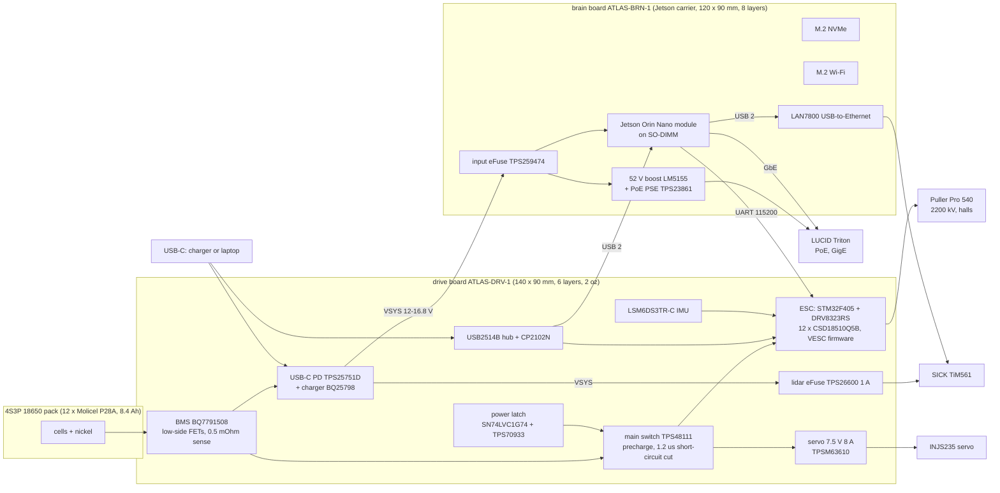

# Car v2: integrated electronics and printed kit

Design for the second Atlas car on the Traxxas Slash 4x4 (6822 chassis, the one with the
"KA2246-R00" label and the Holmes Hobbies Puller Pro 540 2200 kV motor). The aim: plug in as
few things as possible. Everything that can live on a circuit board does, the battery is
built in and charges over USB-C, and the body is printed in carbon-fibre filament in the
style of the Neobotics NeoRacer.

Status on 2026-09-27: see [Status and next steps](#status-and-next-steps) at the end. In short,
both boards are designed and routed and pass KiCad's DRC with no unconnected nets and no
clearance errors; the printed kit is modelled and checked; nothing has been ordered.

## What you plug in

Once, when building the car:

| connection | to | how |
| --- | --- | --- |
| 18650 pack, power | drive board B+ / B- pads | two 10 AWG leads, soldered |
| 18650 pack, cell taps + temperature | drive board | one 7-pin JST-XH |
| motor phases | drive board | three 12 AWG pigtails soldered to the board, 4 mm bullets to the motor |
| motor hall sensor | drive board | the motor's own 6-pin sensor lead (JST-ZH assumed, confirm on the motor) |
| steering servo | drive board | the servo's own 3-pin lead |
| lidar power | drive board | the donor M12 power cable into a 2-pin terminal |
| lidar Ethernet | brain board RJ45 #2 | the donor M12-D to RJ45 cable |
| camera | brain board RJ45 #1 | one M12 X-coded to RJ45 cable: data and PoE power together |
| Jetson fan, side-pod fan | brain board / drive board | their own leads |
| Wi-Fi antennas | M.2 Wi-Fi card | two u.FL |
| E-stop loop (optional) | drive board | 2-pin JST-PH, normally closed; a jumper if unused |

Every day: **one USB-C cable.** A 65 W USB-C charger charges the car. A laptop on the same
port reaches the Jetson (USB networking and flashing), VESC Tool on the ESC and the Jetson's
serial console, and keeps the car alive while you work.

Compared with car 1, this removes the XT90 Y-harness, the separate ESC and its USB lead, the
PD trigger cable and barrel jack, the power bank, the BEC and its fused tap, the PCA9685 board,
the USB hub and every USB sensor cable. The two boards plug into each other.

## System

Why two boards and not one: the ESC and battery path need thick copper (2 oz) and carry
70-150 A; the Jetson carrier needs eight layers with impedance-controlled pairs for PCIe and
USB and fine pitch for the 260-pin module socket. One board would have to be both, which makes
the whole thing expensive and hard to route. Stacked, they plug together through a 2 x 20
header with no wires, each can be tested alone, and if the carrier has a bug the Jetson module
goes back on its NVIDIA dev-kit carrier while the drive board keeps running the car.

## Power budget

| load | power | source |
| --- | --- | --- |
| Jetson Orin Nano module, 25 W mode, + carrier losses | about 27.5 W | NVIDIA power modes; 10 % carrier loss assumed |
| NVMe SSD | about 3.5 W peak | typical M.2 NVMe |
| Wi-Fi card | about 2 W | typical |
| LAN7800 | about 1 W | typical |
| SICK TiM561 | 4 W typical | SICK datasheet 1071419 |
| LUCID Triton over PoE | 3.1 W at the camera, about 4 W with the boost and PSE losses | Edmund Optics listing for TRI023S-CC |
| drive board logic, fans | about 3 W | estimate |
| **compute rail total** | **about 45 W: 3.1 A at 14.4 V, 3.7 A at 12 V** | |
| motor | 70 A continuous, about 150 A bursts | team's own logs |
| servo | 7.5 V, up to 8 A (10 A peak) | TPSM63610 rating |

Pack: 4S3P Molicel P28A = 14.4 V nominal, 16.8 V full, 8.4 Ah, about 121 Wh, 105 A maximum
continuous (35 A per cell, 18650batterystore.com). That is above 100 Wh, so flying with it
needs airline approval (the 100-160 Wh class). With the car parked and everything on (45 W)
it runs about 2.5 hours; driving time depends on how hard the motor works.

Charging: the BQ25798 accepts 3.6-24 V at up to 3.3 A on VBUS and charges at up to 5 A
(BQ25798 datasheet, recommended operating conditions). The input limit is set to 3.25 A, so a
65 W charger at 20 V is the most it can use. With the car off, about 60 W goes into the pack:
roughly 2.5 hours from empty. With the car on, the compute rail takes about 45 W of the 65 W, so
the pack charges slowly while you debug. A laptop port (5 V, 7.5-15 W) keeps the car alive on
the bench but will not fully charge it.

## Drive board (ATLAS-DRV-1)

140 x 90 mm, 6 layers, 2 oz copper on every layer, ENIG. Sources in `boards/drive/`: `design.py` is the
circuit (every part with the reason for its value), `layout.py` the placement and the
hand-drawn copper, and the KiCad files are generated from them. The board stands on six 7 mm
standoffs on the printed deck. The ESC power stage is on its underside and presses through a
1 mm thermal pad onto an aluminium heat spreader, with a 40 mm fan in the right side pod
blowing across it.

**Battery protection.** TI BQ7791508: a 3-5S protector that needs no microcontroller, with
cell balancing. This variant trips at 4.20 V over-voltage and 3.00 V under-voltage per cell,
over-temperature 65 C, and recovers from current faults on its own. It drives low-side charge
and discharge FETs (4 + 4 CSD18510Q5B) in the pack's negative lead. Its current thresholds are
voltages across the sense resistor, so the 0.5 mOhm four-terminal shunt (Isabellenhuette BVR,
4026) sets them: OCD1 70 mV = 140 A for 1.4 s, OCD2 140 mV = 280 A for 0.7 s, short circuit
300 mV = 600 A for 0.4 ms, charge over-current 60 mV = 120 A. The VESC input-current limit
(90 A) keeps normal driving under OCD1.

**Main switch and precharge.** A TI TPS48111 high-side driver switches the motor bus through
four CSD18510Q5B, with a 0.2 mOhm shunt. The STM32 sequences it: first the precharge FET, which
charges the ESC capacitors through two pulse-proof 22 Ohm resistors in parallel (time constant
about 16 ms), then, once the bus voltage has come up, the main FETs. No spark and no BMS
short-circuit trip at switch-on. If the bus is still under 4 V after 10 ms, something on it is
shorted, and the firmware gives up rather than cook the resistors. The TPS48111 cuts a
short circuit (350 A) in 1.2 us and an overload (150 A for 10 ms) on its own, retries after
15 s, and reports the bus current to the MCU.

**Power button.** A TPS70933 LDO keeps a 3.3 V always-on rail from the pack (1 uA). An
SN74LVC1G74 flip-flop is the on/off latch: a press of the on-board button (or a remote button
on the 2-pin connector) sets it, which turns on the main switch and the 5 V buck. The MCU turns
the car off by clearing the latch (KILL, PB12), after the Jetson has shut down. A crash or reset
of the MCU does not turn the car off. The same press wakes the charger out of ship mode.

**USB-C charging.** TI TPS25751D USB PD controller (integrated sink switch) plus TI BQ25798
buck-boost charger. The TPS25751D loads its configuration from a 64 KB I2C EEPROM (M24512),
negotiates up to 20 V and programs the BQ25798 over I2C with no MCU. The EEPROM image is made
with TI's Application Customization Tool; a 4-pin header (not fitted) can reprogram it on the board. The
BQ25798 is set for 4S and 1.5 MHz by its PROG resistor, with the input limit at 3.25 A. Its
SYS output (NVDC power path) is the compute rail, VSYS, so the Jetson and the lidar run from
USB power whenever it is plugged in. The pack's NTC goes to the BMS; the charger's TS input sees
a fixed 25 C divider.

**One cable for debugging.** The USB-C data pins go to a Microchip USB2514B hub. Port 1: the
Jetson's USB0 (L4T USB networking at 192.168.55.1). Port 2: the STM32's USB (VESC Tool).
Port 3: a CP2102N bridge to the Jetson's debug UART (boot log and console). A FLASH slide
switch and two TS3USB30E switches connect the USB-C port straight to the Jetson's USB0
instead, because NVIDIA asks for a direct link in recovery mode. These five high-speed links
are routed as coupled pairs (0.15 mm tracks, 0.15 mm gap, 0.2 mm to everything else). The
width for 90 Ohm depends on the stack-up actually ordered, so check it in JLCPCB's impedance
calculator before ordering and ask for impedance control.

**ESC.** A VESC-6-class design: STM32F405RGT6 and TI DRV8323RS gate driver (three
current-sense amplifiers, gain 40 V/V, and a small buck that makes the board's 5 V), twelve
CSD18510Q5B (40 V, 0.79 mOhm typical at 10 V; TI datasheet SLPS632), two per switch, three
0.2 mOhm low-side shunts (range +-206 A), 4 x 330 uF hybrid polymer bulk capacitors plus
12 x 10 uF ceramics next to the FETs. Conduction loss at 70 A with the FETs hot
(1.5 x Rds(on)): 3 x 70^2 x 0.6 mOhm = about 9 W, plus a few watts of switching. The board
keeps the Trampa HD60 pin map on purpose, so the firmware change is small:
`firmware/vesc/hw_atlas_drv1.{h,c}` (derived from `hw_hd60`, GPL-3.0). The changes: the IMU's
SDA moves off PB2 so BOOT1 stays low for the ROM bootloader, the power-hold pin becomes KILL,
and PA4-PA7, PC10, PC14 and PC15 carry the new brain-power, current, precharge, E-stop and
Jetson-handshake signals. The target builds with the stock VESC tree. The Jetson talks to it on
USART3 at 115200 baud, the same as car 1, so `vesc_driver` does not change.

**Other outputs.** Servo: TI TPSM63610 power module (integrated inductor, 8 A, 10 A peak) set
to 7.5 V from the switched motor bus, on above 9 V, with 4 x 47 uF plus 220 uF polymer on its
output for stall pulses; the signal comes from the VESC servo output through a 5 V buffer.
Lidar: TI TPS26600 eFuse at 1 A from VSYS into a 2-pin terminal, off until the Jetson enables
it, so the Jetson can power-cycle the lidar. Fan: 5 V, 4-pin header, full speed.

**Sensing and safety.** LSM6DS3TR-C IMU on the VESC's bit-banged I2C (the VESC `lsm6ds3`
driver). TI INA228 on the BMS shunt gives the Jetson pack voltage, current and energy over I2C.
SN65HVD230 for a spare CAN port with a termination jumper. E-STOP: a normally-closed 2-pin loop
AND-ed in hardware (74LVC1G08) with the MCU's gate-enable pin into the DRV8323's ENABLE, so
opening the loop (a big red button or a wireless relay) stops the motor even if the firmware
is hung.

## Brain board (ATLAS-BRN-1): the Jetson carrier

120 x 90 mm, 8 layers, impedance-controlled, ENIG. It is a fork of Antmicro's open-source
Jetson Orin Baseboard (github.com/antmicro/jetson-orin-baseboard, Apache-2.0, 120 x 60 mm):
the hard high-speed layout around the module socket, the M.2 slots and the module supply is
kept exactly as Antmicro routed it, and the board grows by a 30 mm strip for the new circuits.
`boards/brain/fork_config.py` lists every change; `fork.py` and `tools/fork_pcb.py` apply them
to Antmicro's schematic and board.

Kept: SO-DIMM module socket, module power section, M.2 Key M (2280 NVMe), M.2 Key E (Wi-Fi),
the RJ45 with its magnetics, RTC backup, fan header, reset and recovery buttons, the I/O
expander.

Removed: both CSI camera connectors (the camera is GigE), HDMI, the USB-C debug/DisplayPort
port and the USB 3 USB-C port with their PD controller (charging and USB live on the drive
board), the DC barrel input, the PoE powered-device front end, and the expansion socket.

Added:
- **Board input.** A TPS259474 eFuse takes VSYS from the stack header when the drive board
  raises POWER_EN, limits it to 5 A, turns off above 19.2 V and soft-starts the module supply.
- **PoE for the camera.** A TI LM5155 boost makes 52 V from VSYS (300 kHz, 47 uH Coilcraft
  XAL7070, CSD19538Q3A switch), and a TI TPS23861 IEEE 802.3at PSE, running in its automatic
  mode, powers port 1 on the centre taps of the RJ45 that already carries the module's Gigabit
  Ethernet. The Triton needs IEEE 802.3af and draws 3.1 W. This replaces the AC PoE injector
  the camera needed.
- **Second Ethernet for the lidar.** A Microchip LAN7800 USB-to-Gigabit bridge on the module's
  USB 2 pair (the one Antmicro used for the USB-C port), with its own RJ45. The TiM561 is
  100BASE-TX; the stock L4T kernel has the `lan78xx` driver. The chip is turned so its
  Ethernet pins face the jack: the four pairs run straight to it as 100 Ohm pairs and the USB 2
  pairs as 85 Ohm pairs, with the widths and gaps Antmicro set for this stack-up.
- **Stack header.** 2 x 20, 2.54 mm long-pin header on the underside mating the drive board's
  socket. The module's UART is 1.8 V, so an NTS0102 shifts it to the STM32's 3.3 V. The
  expander pins that drove the removed camera and USB-C switches now carry the drive board
  signals (STM32 reset and BOOT0, lidar enable, E-stop and charger status).

The module from the Orin Nano Super dev kit moves over with its heatsink and fan. The
dev-kit carrier stays in the drawer as the fallback.

## Stack header (drive board to brain board)

The brain board stands 20 mm above the drive board on four M3 standoffs, one at each corner.
The connector is a Samtec SSQ-120-03-G-D socket on the drive board and a TSW-120 long-pin
header on the brain board. `boards/stack/stack.py` defines the pin map once for both boards;
`boards/tools/check_stack.py` checks both finished boards against it (nets, pin positions, and
that each brain-board corner hole sits over a drive-board hole).

| pins | signal | direction | note |
| --- | --- | --- | --- |
| 1-6 | VSYS | drive to brain | 12-16.8 V, 6 pins x 3 A |
| 7-10, 13-14, 29-30, 36-40 | GND | | |
| 11, 12 | USB0 D+ / D- | both | Jetson USB0: hub port 1, or straight to USB-C when flashing |
| 15, 16 | VESC UART | Jetson UART1 to STM32 USART3 | 115200 baud, 3.3 V, vesc_driver |
| 17, 18 | console UART | Jetson debug UART to the CP2102N | 3.3 V |
| 19, 20 | I2C SCL / SDA | Jetson I2C1 | INA228, board ID EEPROM, TPS25751 |
| 21 | PWR_BTN_N | drive to brain | power button: the Jetson shuts down |
| 22 | OS_HALTED | brain to drive | high once the module is off; the MCU may cut power |
| 23 | POWER_EN | drive to brain | turns on the brain board's input eFuse |
| 24 | MCU_NRST | brain to drive | the Jetson can reset the STM32 (open drain) |
| 25 | MCU_BOOT0 | brain to drive | the Jetson can start the STM32 bootloader |
| 26 | ESTOP_OK | drive to brain | E-stop loop closed |
| 27 | CHG_STAT | drive to brain | low while charging |
| 28 | LIDAR_EN | brain to drive | TPS26600 enable |
| 31, 32 | spare | | brain-board expander pins; test pads on the drive board |
| 33, 34 | CAN TX / RX | Jetson CAN | 3.3 V; test pads on the drive board |
| 35 | 3V3_DRV | drive to brain | reference for the level shifters |

## The pack

Twelve Molicel P28A (18.6 x 65.2 mm, 46 g) standing upright in a 2 x 6 grid, 4S3P, inside a
printed box in the stock battery bay. With the first and last groups flipped, both main
terminals come out on top, so the leads go straight up through the lid to the drive board.
Details, strip layout and safety: `docs/PACK_BUILD.md`.

## Software changes

- ESC: build `fw_atlas_drv1` from `firmware/vesc/`, flash once with an ST-Link over SWD, then
  update over USB from VESC Tool. `vesc_driver` keeps working over the UART at 115200.
- Lidar: SICK's `sick_scan_xd` ROS 2 driver supports the TiM5xx family over Ethernet; the
  TiM561 ships at 192.168.0.1.
- Camera: LUCID's Arena SDK and `arena_camera_ros2`. Enable jumbo frames on the camera port.
- IMU: now from the ESC (`vesc_driver` IMU topic) instead of the OAK-D.
- Battery: a small node reads the INA228 over I2C and publishes state of charge.
- Power button: a systemd service shuts the OS down on the power-key event; the drive board
  then cuts power.
- Charger: the TPS25751 EEPROM image, made once with TI's Application Customization Tool.

## Safety

- The BMS works without firmware and sits between the cells and everything else. The main
  switch adds a second, faster short-circuit cut. The E-STOP loop cuts gate drive in hardware.
- There is no fuse between the cells and the BMS FETs, so the pack wiring itself is only as
  safe as its insulation: fish paper on every positive cap, Kapton over every strip, lid on.
- Carbon-fibre-filled filament can conduct at the surface. Never let it be the only
  insulation between two conductors.
- Build and first-charge the pack with an adult supervising, on a non-flammable surface.
- Check the ESC's temperature at 50 A and then 70 A on the bench before racing.

## Why there is no FPGA

The measured bottleneck on car 1 is CPU load (81-90 % on every core with the full stack).
The Jetson's GPU can take the heavy CPU work (the particle filter's ray casting already has a
CUDA implementation), and the STM32 already runs the real-time motor, servo and IMU loops. A
custom RISC-V FPGA would add power, cost and months of design for work the GPU does better.
If a real accelerator need appears later, an off-the-shelf FPGA card (LiteFury or Acorn,
Artix-7 on M.2, which can run open-source RISC-V cores) fits the M.2 slot with no board
change.

## Status and next steps

**Done, 27 September 2026.**

- Drive board: 408 footprints on 6 layers, routed with Freerouting, then
  `boards/tools/mazeroute.py`, with the power copper drawn by hand in `layout.py`. DRC: no
  unconnected nets, no clearance errors. It still warns about silkscreen clipped by the board edge
  (6), one reference over copper, and one 0.2 mm piece of track at a corner of a USB pair that it
  calls open (the piece overlaps the rest of the track).
- Brain board: DRC shows no unconnected nets and no clearance errors. It still lists 199
  footprint-library differences (Antmicro's footprints are not the stock KiCad ones), 42
  silkscreen warnings, and the courtyard and hole overlaps that Antmicro excluded in their project.
- Fabrication files for both boards are in `boards/*/out/fab/`: zipped Gerbers and drill files,
  pick-and-place and BOM.
- The stack header check passes: 40 pins on both boards, the corner holes line up, 20 mm gap.
- Simulations: `sim/README.md`. Printed kit: `mech/README.md`.

**Layout notes.** Choices made while routing that the schematic does not show:

- Drive: phase B's outer low-side gate resistor R517 sits 0.55 mm closer to its gate via than
  the matching resistors of phases A and C, so the driver's phase C gate pair can fan out past it.
- Drive: phase A's divider resistor R507 and filter capacitor C508 are on the underside, beside
  SENS_A's via under the corner of the MCU. On top, the automatic placer had boxed them in.
- Drive: the PPHV branch to C713 runs straight down beside it. That lets the charger's STAT line
  leave the PMID copper to the west instead of cutting the PMID pour in two.
- Drive: PD_IRQ_N runs along the edge of the motor-supply keep-out, which leaves room beside U701
  for the two vias that take the stack's I2C lines down to the inner layers.
- Drive: about 20 capacitors and resistors had their ground pad cut off in a small island of the
  outer ground fill. Each now has its own via or a short track to ground. Five of those vias sit
  in or at the pad, which is fine because JLCPCB fills and caps every via on 6-layer boards at no
  charge; keep that option when ordering. To make room, VBUS_C's inner-layer run under C703 moved
  1.5 mm, and short stretches of seven signal and 3.3 V nets were routed again.
- Drive: the stack header's ground pins have one thermal spoke on the inner ground fills. A rule in
  `atlas_drive.kicad_dru` allows that; the planes and outer fills connect them as well.
- Brain: the LM5155's VCC capacitor C1209 sits right under the VCC pin, in the corner the
  inductor, the FET and the controller leave.

**Before ordering.**

1. Measure the chassis numbers in `docs/MEASURE_FIRST.md`, then print the fit coupons and try
   them on the car.
2. Check the USB pair widths in JLCPCB's impedance calculator for the stack-up you order, and
   ask for impedance control on both boards.
3. Order the drive board with its vias filled and capped (JLCPCB's default on 6 layers).
4. Make the TPS25751D's EEPROM image with TI's Application Customization Tool. Program the
   EEPROM before assembly, or fit the 4-pin header and write it on the board.
5. Build the VESC firmware target from `firmware/vesc/`.

**First power-up.** Pack and BMS alone first, then the main switch and precharge with no motor,
then USB-C charging, then the ESC on the bench at 50 A and 70 A with a thermocouple on a bus
capacitor and on the FETs (see Safety above).
