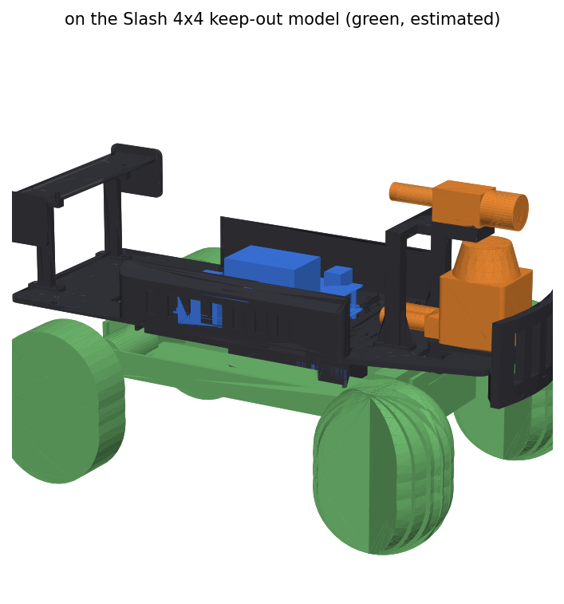

# Printed kit

The kit is one CadQuery script, `kit.py`. It builds every part and places it on a keep-out model of the
Slash 4x4. Then it checks every pair of solids for overlap, slices the lidar scan plane, exports STEP and STL
(and a DXF for the aluminium heat spreader), and renders PNGs.

`extras.py` builds on it and adds the parts that finish the car: the stack canopy with the Wi-Fi antennas, the
wheels-off bench stand, the mating plugs, and every cable as a path through the model. It checks all of them
against the kit and writes `out/extras_report.json`. The cable lengths from that report are in
`../docs/WIRING.md`, and `../docs/COMPLETE_CAR.md` explains each addition.

    pip install cadquery ezdxf matplotlib
    python3 kit.py                 # about 3 minutes; writes out/ and out/kit_report.json
    UNDER_CLEARANCE=42 python3 kit.py    # any number in P can be overridden the same way
    python3 extras.py              # about 1 minute; canopy, bench stand, plugs and cables, out/extras_report.json

Last run (27 September): zero interference between any two printed parts, bought parts (boards and their tall
components, sensors, cells) or chassis keep-outs. `extras.py` also finds zero between the new parts, the
plugs, the cables and all of those.

Two changes that day came out of modelling the plugs and cables:

- The right side pod's fan moved forward, and a slot through the pod now lets the camera's RJ45 plug out.
- The servo-lead slot in the deck moved clear of the front splice plate.

The only solids that cross the lidar's scan plane (the camera arch legs, the wing, and from `extras.py` the
canopy, its standoffs, the antennas and two cables) sit inside its 90 degree blind sector at the rear. Scan
plane 68.5 mm above the deck, camera axis 122 mm above the deck, pack box inside the battery bay
with 2.8 mm under it. Tightest fit in the board stack: the brain board's NVMe SSD sits 2.4 mm above
the drive board's bulk capacitors.

## Parts

**Before printing, read [PRINTING.md](PRINTING.md):** several STLs in `out/stl` are not in a printable orientation (the bumper failed on Sept 30). It lists which parts to flip and which need supports.

Sizes are as they sit on the bed (mm). Mass is for solid PETG-CF; with 4 walls and 35 %
gyroid expect about 65 % of it. Everything fits a 250 x 250 bed (Bambu P1S: 256).

| part | print | bed size | solid mass | orientation, notes |
| --- | --- | --- | --- | --- |
| `fit_coupon_front`, `fit_coupon_rear` | 1 each, FIRST | 56-58 x 132 x 25 | 55 / 57 g | top face down, like the deck. Strips of the deck across the towers and body posts: test the saddles and post slots on the real car. Both on one plate: 2 h 30 min, 67 g (P1S, 35 % gyroid) |
| `deck_rear`, `deck_mid`, `deck_front` | 1 each | 146-162 x 178 x 15-25 | 182 / 158 / 171 g | top face down; saddles and ribs point up, no supports. The three pieces butt together and bolt to splice plates underneath |
| `splice_rear_left`, `_right`, `splice_front_left`, `_right` | 1 each | 30 x 72 x 3 | 8 g | flat; 6 x M3 bolts + nylocs each, across the joint |
| `lidar_plinth` | 1 | 70 x 64 x 6 | 24 g | pocket face down; 2 x M3 x 6 into the TiM561's bottom threads (2.0 mm engagement, SICK allows 2.8) |
| `bumper` | 1 | 62 x 124 x 74 | 113 g | flange down; bolts up through the deck into the plinth (4 x M3 x 16) |
| `camera_arch` | 1 | 80 x 102 x 104 | 83 g | feet down; the tongue is a 34 mm bridge |
| `camera_cradle` (0 deg), `_down5`, `_down10` | pick one | 43 x 34 x 4-8 | 7 g | flat; slotted +-1.5 mm for the camera's M3 holes |
| `side_pod_left`, `side_pod_right` | 1 each | 225 x 25 x 50 | 80 / 68 g | outer face down, vents vertical; the right pod holds the 40 mm fan and has the slot the camera plug goes out through |
| `wing_blade` | 1 | 55 x 190 x 46 | 72 g | endplates up |
| `wing_strut_left`, `_right` | 1 each | 35 x 88 x 14 | 16 g | on their side |
| `pack_box` | 1 | 138 x 51 x 72 | 67 g | open end up |
| `pack_lid` | 1 | 138 x 51 x 4 | 27 g | ribs up |
| `cell_holder_bottom`, `_top` | 1 each | 120 x 40 x 5 | 12 g | pockets up |
| `post_washer` | 4 | 30 x 30 x 3 | 3 g | body clips sit on these above the deck |
| `stack_canopy` (extras.py) | 1 | 128 x 99 x 6.4 | 41 g | top face down, no supports; cover over the board stack with the antenna jacks and the fan grille |
| `bench_stand` (extras.py) | 1, PLA | 173 x 123 x 128 | 267 g solid (PETG-CF density) | pad face down; a workshop tool, not on the car |

Total about 1.2 kg solid, about 0.8 kg of filament as printed.

## Material and settings

CF-filled filament is abrasive: use a hardened-steel nozzle (0.4 or 0.6 mm), and dry the
spool first.

| part | material | settings |
| --- | --- | --- |
| deck halves, plinth, arch, wing struts | PETG-CF (or PA-CF if the printer has an enclosure and a dry box) | 0.2 mm layers, 4 walls, 35 % gyroid, 5 top/bottom |
| bumper | PETG-CF; PA-CF is tougher in a crash | 5 walls, 40 % gyroid |
| side pods, wing blade, pack lid | PETG-CF | 3 walls, 20 % gyroid |
| pack box, cell holders | PETG-CF or plain PETG | 3 walls, 30 %; holders at 100 % so the pockets stay round |

Do not rely on CF-filled plastic as electrical insulation: carbon fibre conducts. The pack
has fish paper and Kapton for that.

## Hardware

- M3 brass heat-set inserts (4.0 mm hole, 5 mm deep), about 30 in the deck and the sensor mounts:
  drive board standoffs 6, pack box 6, camera arch 4, side pods 5, wing 4, plinth 4. Buy 50.
- Deck joints: 24 x M3 x 12 socket screws and nylocs through the deck and the four splice plates.
- Board stack: 6 x M3 7 mm male-female standoffs from the deck inserts to the drive board
  (holes H1001-H1004, H1007, H1008), and 4 x M3 20 mm male-female standoffs from the drive board
  to the four corners of the brain board. Over H1002 and H1004 the 20 mm standoff screws through
  the drive board into the 7 mm one below it; over H1005 and H1006 it is held by an M3 nut under
  the drive board. Four M3 x 6 screws on top of the brain board, four more on the drive board's
  other deck holes.
- Heat spreader: 3/16 in (4.76 mm) 6061, 60 x 48 mm, cut from `out/dxf/heat_spreader.dxf`. Order it
  with the four 2.5 mm holes tapped M3. Four M3 x 8 screws come up through the deck into it. The
  notch at one corner makes room for the H1005 nut. A 1.0 mm thermal pad goes between the spreader
  and the bottom of the FETs.
- M3 socket screws 6-16 mm for the rest, and the chassis's own body clips over the post washers.
- Canopy: 3 x M3 40 mm male-female standoffs. They replace the M3 x 6 top screws at three of the brain board's
  corners (brain-local (115.06, 5.06), (6, 84) and (114, 84)); the fourth corner sits under the camera RJ45.
  3 x M3 x 6 button-head screws hold the canopy on them.
- Two RP-SMA antennas and two pigtails from the Wi-Fi card to the canopy, and zip ties (`../docs/WIRING.md`).

## Assembly order

1. Heat-set all inserts. Bolt the three deck pieces to the splice plates.
2. Pack: build it (`docs/PACK_BUILD.md`), drop the box into the bay through the deck window,
   lid on.
3. Deck onto the towers, posts through the slots, washers and body clips on.
4. Lidar screwed to the plinth on the bench; plinth, deck and bumper bolted together from
   below.
5. Camera arch, cradle, camera.
6. Heat spreader (screwed to the deck from below) and thermal pad, 7 mm standoffs, drive board.
   Wire the lidar power terminal (J902) now: its screws end up under the brain board's front edge.
7. 20 mm standoffs, then the brain board. Clip the two Wi-Fi pigtails onto the M.2 card before the Jetson
   module goes on, because the card sits under it.
8. Side pods, fan, wing. Plug in the list in `docs/ARCHITECTURE.md`; the camera plug goes out through the slot
   in the right pod. The runs are in `docs/WIRING.md`.
9. The 40 mm canopy standoffs, then the canopy, with the pigtails' RP-SMA jacks nutted into its two holes.
   Screw the antennas on last.

## What the model does not know

Every chassis dimension is an estimate carried over from car 1 until it is measured
(`docs/MEASURE_FIRST.md`). The camera's bottom hole spacing is an estimate. The TiM561's
swivel-unit and plug sizes are estimates (the SICK drawing does not give them).
